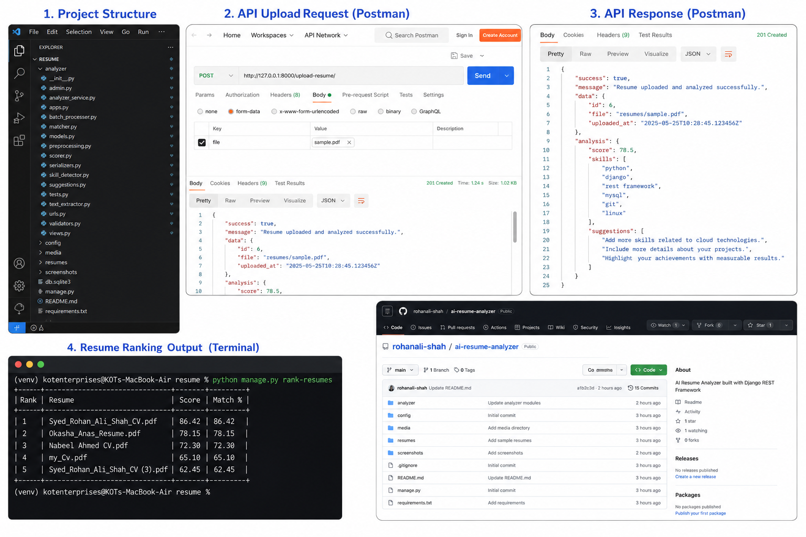

# AI Resume Analyzer

A Django REST Framework application that analyzes resumes using Natural Language Processing (NLP). It extracts text from uploaded resumes, detects technical skills, scores candidates, generates improvement suggestions, and compares resumes with job descriptions.
---

## Features

- Upload PDF and DOCX resumes
- Extract text from resumes
- Clean and preprocess text
- Detect technical skills
- Score resumes based on skills and experience
- Generate improvement suggestions
- Match resumes with job descriptions
- Rank multiple resumes
- REST API built with Django REST Framework

---

## Tech Stack

- Python
- Django
- Django REST Framework
- spaCy
- PyPDF2
- python-docx
- scikit-learn
- NLTK

---

## Project Structure

```
resume/
│
├── analyzer/
├── config/
├── resumes/
├── media/
├── manage.py
├── requirements.txt
└── README.md
```

---

## Installation

```bash
git clone <repository-url>

cd resume

python -m venv venv

source venv/bin/activate

pip install -r requirements.txt
```

---

## Run Server

```bash
python manage.py migrate

python manage.py runserver
```

---

## API Endpoint

```
POST /upload-resume/
```

Upload using **multipart/form-data**

Field:

```
file
```

---

## Resume Scoring Logic

The resume score is calculated using:

- Technical Skills
- Years of Experience
- Keyword Matching

The final score is returned as a percentage.

---

## Job Matching

The project supports:

- Skill Matching
- Missing Skill Detection
- TF-IDF
- Cosine Similarity

---
# Project Overview

